# System Architecture

## MarketPilot AI — Architecture Documentation

**Version:** 1.0  
**Date:** July 2026

---

## 1. High-Level System Architecture

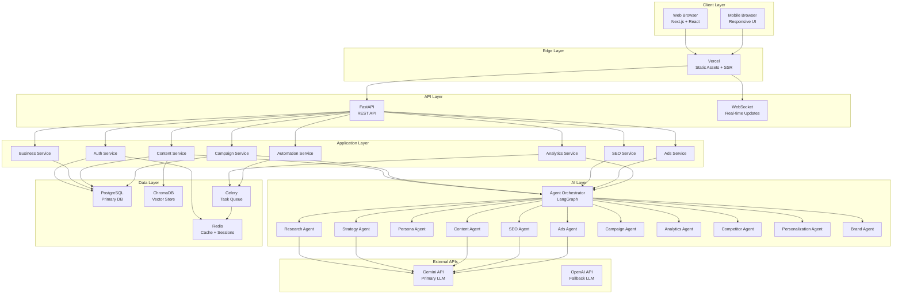

---

## 2. Data Flow Architecture

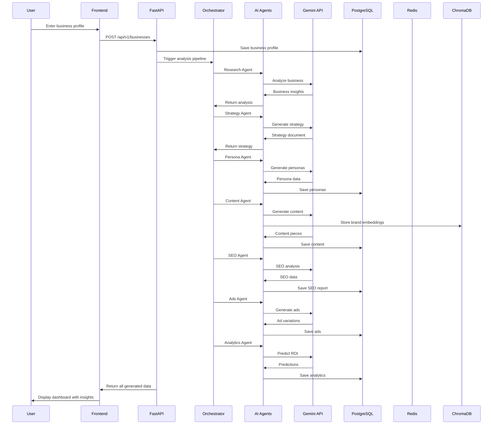

---

## 3. Agent Orchestration Flow

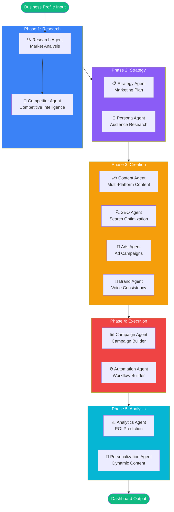

---

## 4. Database Entity Relationship Diagram

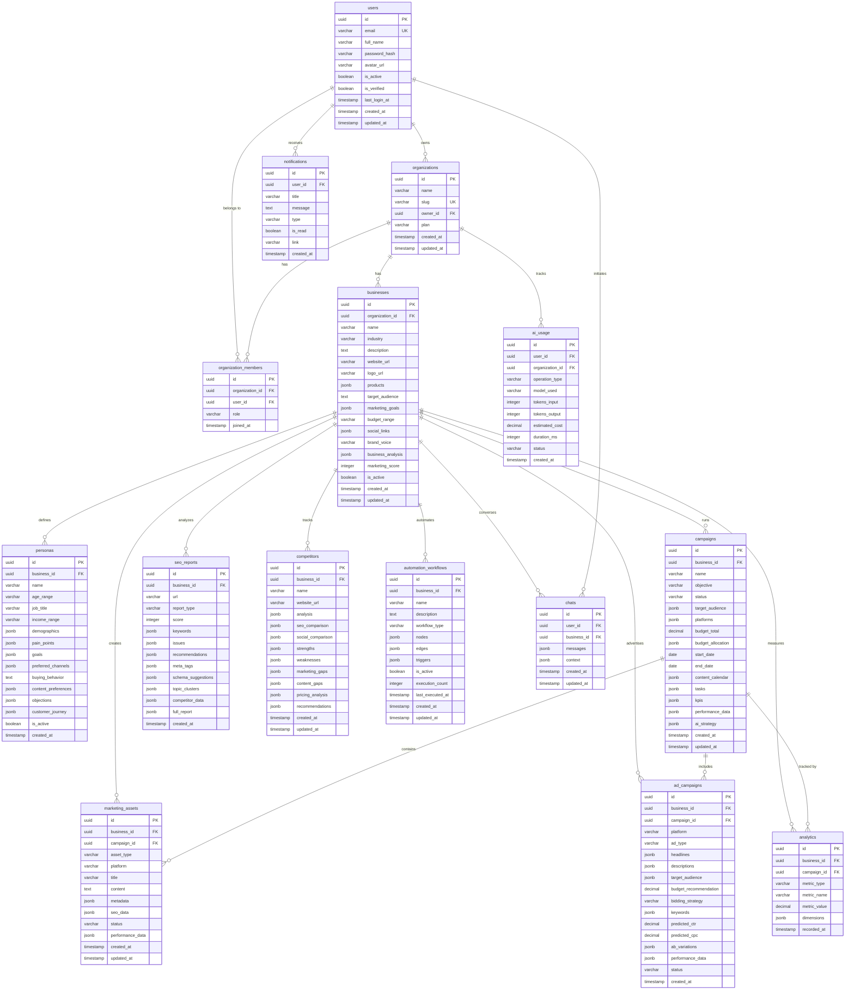

---

## 5. Deployment Architecture

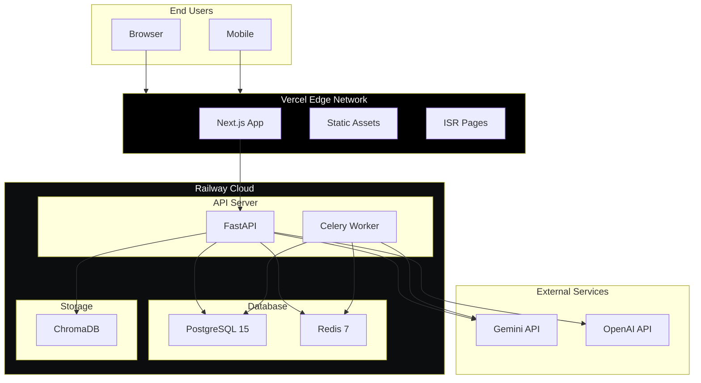

---

## 6. User Flow Diagrams

### Onboarding Flow

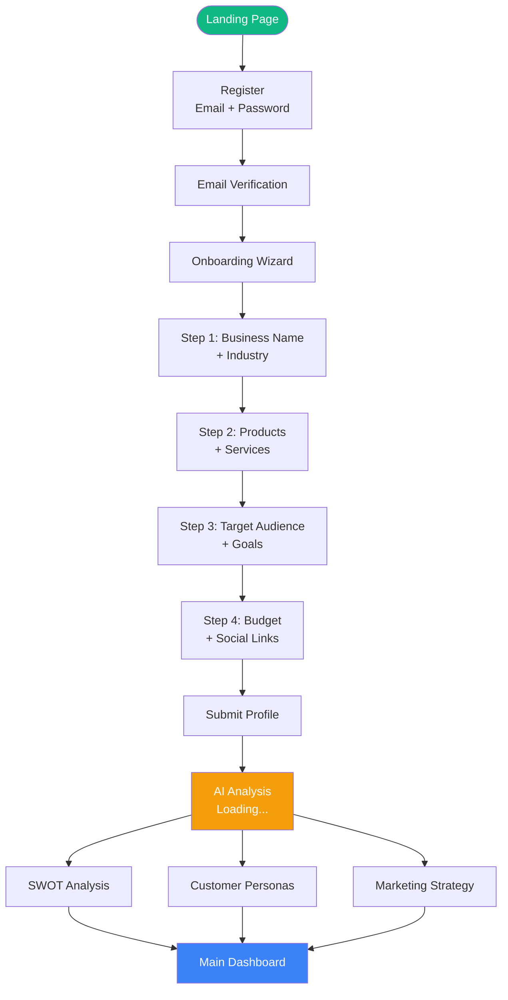

### Content Generation Flow

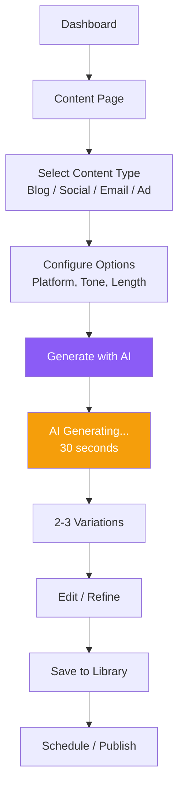

### Campaign Creation Flow

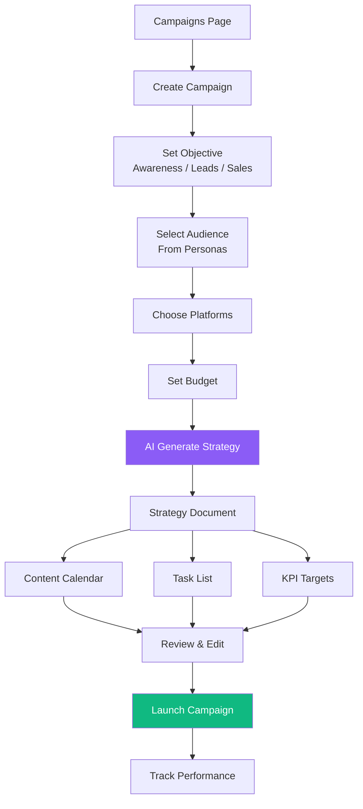

---

## 7. Security Architecture

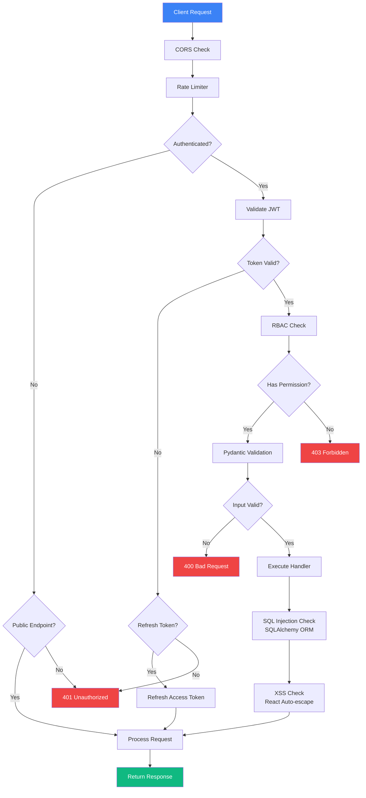

---

## 8. Component Architecture (Frontend)

```mermaid
graph TB
    subgraph Layout["Layout Components"]
        RootLayout["RootLayout"]
        DashboardLayout["DashboardLayout"]
        Sidebar["Sidebar"]
        Header["Header"]
        MobileNav["MobileNav"]
    end
    
    subgraph Pages["Page Components"]
        Dashboard["Dashboard Page"]
        BusinessList["Business List"]
        BusinessDetail["Business Detail"]
        ContentPage["Content Page"]
        CampaignsPage["Campaigns Page"]
        SEOPage["SEO Page"]
        AdsPage["Ads Page"]
        CompetitorsPage["Competitors Page"]
        PersonasPage["Personas Page"]
        AutomationPage["Automation Page"]
        AnalyticsPage["Analytics Page"]
        ChatPage["Chat Page"]
    end
    
    subgraph Features["Feature Components"]
        MarketingScore["MarketingScore"]
        CampaignHealth["CampaignHealth"]
        GrowthChart["GrowthChart"]
        ContentEditor["ContentEditor"]
        CampaignForm["CampaignForm"]
        WorkflowBuilder["WorkflowBuilder"]
        ChatInterface["ChatInterface"]
        PersonaCard["PersonaCard"]
        SEOAudit["SEOAudit"]
        AdPreview["AdPreview"]
    end
    
    subgraph Shared["Shared Components"]
        LoadingSkeleton["LoadingSkeleton"]
        EmptyState["EmptyState"]
        PageHeader["PageHeader"]
        ConfirmDialog["ConfirmDialog"]
        Toast["Toast Notifications"]
    end
    
    RootLayout --> DashboardLayout
    DashboardLayout --> Sidebar
    DashboardLayout --> Header
    DashboardLayout --> MobileNav
    
    DashboardLayout --> Dashboard
    DashboardLayout --> BusinessList
    DashboardLayout --> ContentPage
    
    Dashboard --> MarketingScore
    Dashboard --> CampaignHealth
    Dashboard --> GrowthChart
    
    ContentPage --> ContentEditor
    CampaignsPage --> CampaignForm
    AutomationPage --> WorkflowBuilder
    ChatPage --> ChatInterface
    PersonasPage --> PersonaCard
    SEOPage --> SEOAudit
    AdsPage --> AdPreview
    
    AllPages["All Pages"] --> LoadingSkeleton
    AllPages --> EmptyState
    AllPages --> PageHeader
    
    style Layout fill:#3b82f6,color:#fff
    style Features fill:#8b5cf6,color:#fff
    style Shared fill:#10b981,color:#fff
```

---

## 9. AI Model Selection Strategy

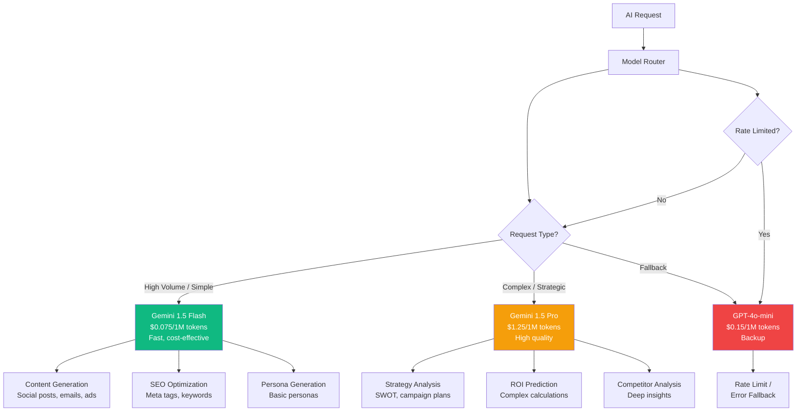

---

## 10. Error Handling Flow

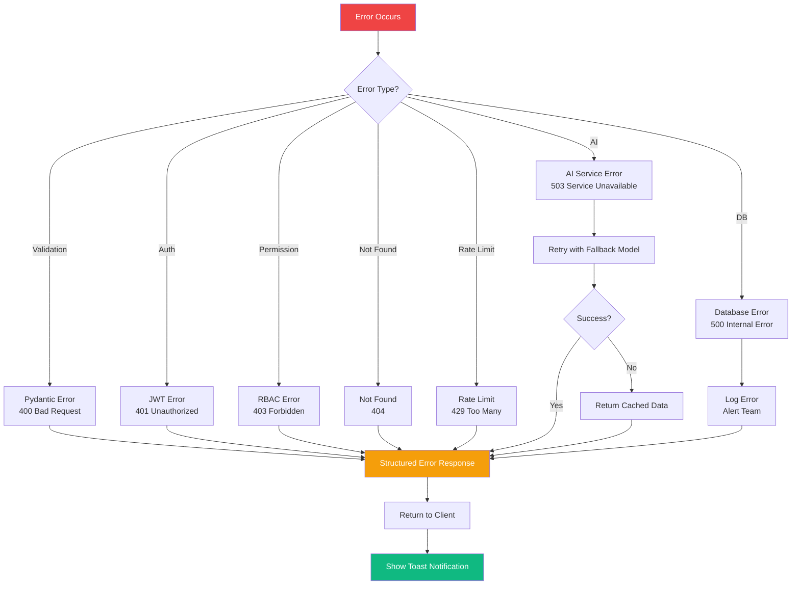

---

*End of Architecture Documentation*
